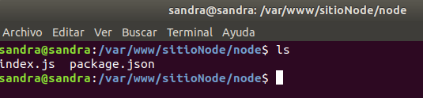

<h1 style="text-align:center"> Práctica Apache</h1>


**Apache** es un servidor web de código abierto desarrollado por Apache Software Foundation. Se trata de un servidor de grado comercial robusto y seguro que se adhiere a todos los estándares HTTP. Ha sido el líder del mercado desde que apareció en 1995 y sigue siéndolo actualmente. Una de sus características principales es que tiene la capacidad de funcionar en múltiples plataformas.

**Características:**

- Gratuito, no requiere licencia.
- Se puede modificar para ajustar el código y/o corregir errores.
- Ofrece la posibilidad de agregar más funciones y módulos.
- Altamente fiable.
- Instalación fácil.
- Los cambios realizado se registran de forma inmediata, incluso sin reiniciar el servidor.
- Puede ejecutarse en casi cualquier sistema operativo.
- Regularmente mantenido y actualizado.
- Integración con otras aplicaciones creando los paquetes XAMPP, LAMPP y MAMP.
- Posibilidad de modificar su configuración.
- Bajo rendimiento si recibe miles de requests simultáneos.


***

**Instalación de Apache**

```
sudo apt-get install apache2
```

**Comandos de utilización**

```
sudo service apache2 start/stop/status/restart(reincia)/reload (recarga la configuración)
```

***

# **SITIO 1**

Este primer sitio permitirá visualizar una página php.

## REQUISITOS

1. ### [Estar publicada en el puerto 82](#punto1)
2. ### [El directorio donde se encuentra el contenido será _/var/wwww/sitioPhp_](#punto2)
3. ### [Los logs se sitúan en el directorio _/etc/logs/sitioPhp_](#punto3)
4. ### [Debe disponer de un fichero de log (_log_personalizado.log_) que mostrará la traza generada por un _CustomLog_ cuyo formato será _"%t%h%m%>s"_, al cual se le asociará el nombre _PhpLogFormat_](#punto4)
5. ### [ Dispone de una página que se mostrará al acceder a una ruta que no exista, mostrando el mensaje _"Página no encontrada"_.](#punto5)

***

## PASOS A SEGUIR

- Iniciamos el servidor Apache

  ```
  sudo service apache2 start
  ```

- Verificamos que esté iniciado

  ```
  sudo service apache2 status
  ```

  

- Creamos el host virtual:

  ```
  sudo mkdir -p /var/www/sitioPhp
  ```

  

- Otorgamos permisos al directorio creado para usuarios distintos a root:

   ```
  sudo chown -R $USER:$USER /var/www/sitioPhp/
   ```

- Damos permisos de lectura y ejecución del directorio web general _/var/wwww para que todos sus archivos y directorios puedan ser servidos correctamente.

  ```
  sudo chmod -R 755 /var/www
   ```

- Creamos una carpeta html dentro de nuestro host virtual e introducimos nuestra página php en el interior.

  

  

  

- Creamos un archivo de configuración para el virtual host (indicará como el servidor Apache va a responder a las solicitudes del dominio). Para ello, utilizaremos como plantilla el fichero de configuración del virtual host por defecto de apache _000-default.conf_ situado en la misma ruta donde vamos a crear el nuestro.

   - Nos situamos en la ruta: _/etc/apache2/sites-available_

   <a href="#punto1"></a> 
   - Creamos el archivo: _sitioPhp.conf_ con el siguiente contenido por defecto y especificando el puerto que queramos, en nuestro caso el 82:

      

- Verificamos que la sintaxis del archivo sea correcta

   ```
   apache2ctl -t
   ```

   

- Añadimos al archivo _etc/apache2/ports.conf_ el puerto 82 mediante la directiva listen

  

- Habilitamos el virtual host con la herramienta a2ensite para que esté disponible:

  

- Nos informa que tenemos que hacer un reload del servidor para que surjan efecto los cambios.

   ```
   systemctl reload apache2
   ```

- Como la página que queremos mostrar en el navegador es de php, instalamos el paquete de php para apache:

   ```
   sudo apt-get install apache2 php libapache2-mod-php
   ```

- Abrimos la página en el navegador, indicando el puerto especificado: _localhost:82_

  


## PERSONALIZAR LOGS

- Cambiamos el directorio donde queremos que se guarden los logs y el nombre del archivo. En nuestro caso se guardarán en _/etc/logs/sitioPhp. Por defecto apache los guarda dentro de la variable _${APACHE_LOG_DIR}_, como vemos en la imagen:

  

Esta variable se encuentra en el archivo de configuración de apache **envars**, en la ruta _/etc/apache2/ y nos guarda el archivo de logs _sitioPhp_access.log_, por defecto en _/var/log/apache2/
 
  

Nosotros vamos a cambiar esa variable, por la ruta donde queremos que se guarden, en este caso, en /etc/logs/sitioPhp.

Primero, creamos la estructura de carpetas, ya que no existen.


Tras esto, vamos al archivo de configuración de nuestro sitio, situado en _/etc/apache2/sites-available y modificamos el archivo sitioPhp.conf, dejándolo como vemos en la imagen:

Hemos cambiado la ruta y también el nombre del archivo de logs, de _sitioPhp_access.log_ a _log_personalizado.log_


Verificamos sintaxis
  
 ```
 apache2ctl -t
 ```

Reiniciamos el servidor

 ```
 sudo systemctl reload apache2
 ```

 Y comprobamos que el archivo sitioPhp_access.log se ha guardado en la ruta correcta y contiene logs:


## CAMBIAR EL FORMATO DEL CUSTOM LOG

En el fichero de configuración de nuestro host virtual (_/etc/apache2/sites-enabled/sitioPhp.conf_) podemos ver como por defecto hemos asignado un _CustomLog_ llamado _**combined**_ para especificar el formato en el que se almacenarán los logs.


Procedemos a modificarlo, para darle a los logs el formato que nosotros queremos; _"%t %h %m %>s"_. Para ello accedemos al fichero donde se especifica este formato, en _/etc/apache2/apache2.conf_ y añadimos nuestro formato a continuación de los anteriores dándole el nombre de PhpLogFormat.


Vamos al archivo de configuración de nuestro host virtual y cambiamos el nombre del _CustomLog_ (combined) por el que acabamos de crear (PhpLogFormat), quedando de la siguiente manera:


Verificamos sintaxis

 ```
 apache2ctl -t
 ```

Reiniciamos servidor:

 ```
 sudo systemctl reload apache2
 ```

 Comparamos el formato anterior:

 

 Con el actual, que nos muestra, la fecha y hora de la petición, el nombre del servidor remoto, el método utilizado para la petición y el código del estatus de la petición.

 


 ## CAMBIAR EL FORMATO DE LOS ERRORES

Vamos a modificar el mensaje de error cuando obtengamos un estatus 404 (página no encontrada). Para ello, añadimos a nuestro archivo de configuración: _/etc/apache2/sites-enabled/sitioPhp.conf_, la siguiente directiva:


Verificamos sintaxis

 ```
 apache2ctl -t
 ```

Reiniciamos servidor:

 ```
 sudo systemctl reload apache2
 ```

- Accedemos a una ruta que no existe y verificamos que nos muestre el mensaje introducido:


# **SITIO 2**

Este segundo sitio permitirá acceder a una aplicación NodeJs que debe estar
ejecutándose en el puerto 3000 de nuestra máquina.

## REQUISITOS

1. Estar publicado en el puerto 81.
2. El directorio donde se encuentra el sitio será /var/www/sitioNode.
3. Los logs se situarán en el directorio /etc/logs/sitioNode.
4. Dispone de un directorio /public_files cuyo contenido se listará al acceder a http://localhost:81/public_files. El acceso a dicho directorio estará restringido a aquellos usuarios conocidos por el sistema. Las directivas necesarias estarán en un fichero .htaccess
5. Al acceder a http://localhost:81/documentación se producirá una redirección
a la página oficial de nodejs (https://nodejs.org/en/)

- Creamos una aplicación Nodejs ejecutándose por el puerto 81.

COnfirmarmos que nuestra aplicación funciona y se ejecuta por el puerto 3000.


- Creamos nuestro virtual host por el puerto 81 siguiendo los mismos pasos que en el punto anterior.

- El directorio donde se encuentra el contenido debe esr /var/www/sitioNode

- Creamos la carpeta


- Colocamos dentro la aplicación node que  hemos creado



- Damos permisos a la carpeta:

  ```
  sudo chown -R $USER:$USER /var/www/sitioNode/
  ```

- Generamos el archivo de configuración, en la ruta _/etc/apache2/sites-enabled_

  

- Escribimos en el archivo las directivas por defecto, más nuestros cambios:

  - Puerto 81
  - Directorio del contenido: /var/www/sitioNode/backend
  - Directorio de logs: /etc/logs/sitioNode

   

- Verificamos sintaxis

  ```
  apache2ctl -t
  ```

- Creamos la carpeta donde se guardarán los logs y que hemos especificado en la directiva:

 

- Especificamos el nuevo puerto que vamos a utilizar (81) en el archivo de configuración de puertos de apache _/etc/apache2/ports.conf

  

- Habilitamos el host virtual

  ```
  sudo a2ensite sitioNode.conf 
  ```

- Reiniciamos servidor

  ```
  sudo service apache2 reload
  ```

- Verificamos que se ha habilitado el host

  

 - Verificamos que se ha creado el archivo de logs

  

- Verificamos que el sitio funciona en el navegador

  


