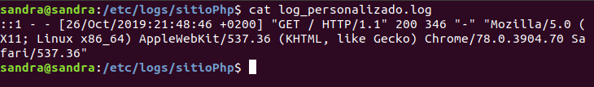
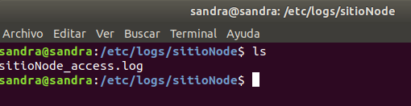
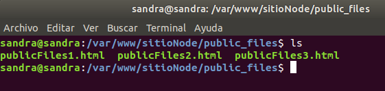
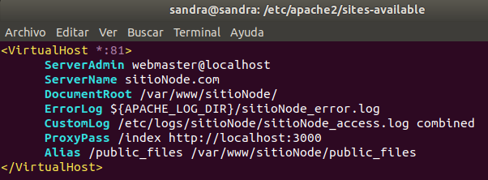
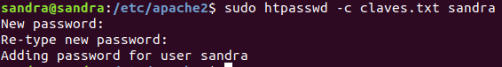
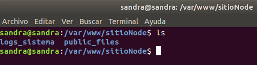
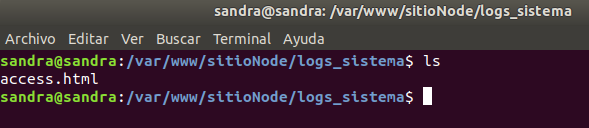

<h1 style="text-align:center"> Práctica Apache</h1>


**Apache** es un servidor web de código abierto desarrollado por Apache Software Foundation. Se trata de un servidor de grado comercial robusto y seguro que se adhiere a todos los estándares HTTP. Ha sido el líder del mercado desde que apareció en 1995 y sigue siéndolo actualmente. Una de sus características principales es que tiene la capacidad de funcionar en múltiples plataformas.

**Características:**

- Gratuito, no requiere licencia.
- Se puede modificar para ajustar el código y/o corregir errores.
- Ofrece la posibilidad de agregar más funciones y módulos.
- Altamente fiable.
- Instalación sencilla.
- Los cambios realizado se registran de forma inmediata, incluso sin reiniciar el servidor.
- Puede ejecutarse en casi cualquier sistema operativo.
- Regularmente mantenido y actualizado.
- Integración con otras aplicaciones creando los paquetes XAMPP, LAMPP y MAMP.
- Posibilidad de modificar su configuración.

***

## OBJETIVOS DE LA PRÁCTICA

En esta práctica aprenderemos a utilizar y configurar el servidor Apache y a crear Hosts Virtuales para alojar nuestros proyectos. Los **hosts virtuales** son alojamientos virtuales de nuestros sitios webs que sirven para poder ejecutar más de un sitio web en un mismo servidor, permitiéndonos así, compartir recursos.


**Instalación de Apache**

```
sudo apt-get install apache2
```

**Comandos más utilizados**

- Iniciar, parar, ver estado, reiniciar o recargar el servidor:

  ```
  sudo service apache2 start/stop/status/restart/reload
  ```

- Verificar sintaxis

  ```
  apache2ctl -t
  ```

***

# SITIO 1

Este primer sitio permitirá visualizar una página php.

**Requisitos:**

1. Estar publicado en el puerto 82.
2. El directorio donde se encuentre el contenido será _/var/wwww/sitioPhp_.
3. Los logs se situarán en el directorio _/etc/logs/sitioPhp_.
4. Deberá disponer de un fichero de log (_log_personalizado.log_) que mostrará la traza generada por un _CustomLog_ cuyo formato será _"%t%h%m%>s"_, al cual se le asociará el nombre _PhpLogFormat_.
5. Dispondrá de una página que se mostrará al acceder a una ruta que no exista, mostrando el mensaje _"Página no encontrada"_.

***

## PUNTOS 1 Y 2. MONTAJE Y CONFIGURACIÓN. PUERTOS.

- Iniciamos el servidor Apache

  ```
  sudo service apache2 start
  ```

- Verificamos que esté iniciado

  ```
  sudo service apache2 status
  ```

  

- Creamos el host virtual en la carpeta _/var/www_

  ```
  sudo mkdir -p /var/www/sitioPhp
  ```

  

- Otorgamos permisos al directorio creado para usuarios distintos a root:

   ```
  sudo chown -R $USER:$USER /var/www/sitioPhp/
   ```

- Damos permisos de lectura y ejecución del directorio web general _/var/www_ para que todos sus archivos y directorios puedan ser servidos correctamente.

  ```
  sudo chmod -R 755 /var/www
   ```

- Creamos una carpeta html dentro de nuestro host virtual, donde estará nuestro programa php:

  

  

- Introducimos  nuestro programa en el interior:

  

- Creamos un archivo de configuración para el virtual host (indicará como el servidor Apache va a responder a las solicitudes del dominio). Para ello, utilizaremos como plantilla el fichero de configuración del virtual host por defecto de apache _000-default.conf_ situado en la misma ruta donde vamos a crear el nuestro.

   - Nos situamos en la ruta: _/etc/apache2/sites-available_

   <a href="#punto1"></a> 
   - Creamos el archivo: _sitioPhp.conf_ con el siguiente contenido por defecto y especificando el puerto que queramos, en nuestro caso el 82:

      

- Verificamos que la sintaxis del archivo sea correcta

   ```
   apache2ctl -t
   ```

   

- Añadimos al archivo _etc/apache2/ports.conf_ el puerto 82 mediante la directiva listen

  

- Habilitamos el virtual host con la herramienta a2ensite para que esté disponible:

  

- Nos informa que tenemos que hacer un reload del servidor para que surjan efecto los cambios.

   ```
   systemctl reload apache2
   ```

   Podemos ejecutar este comando, o como hemos visto al principio:

   ```
   sudo service apache2 reload
   ```

- Verificamos que el sitio ha sido habilitado yendo a la carpeta sites-enables situada en _/etc/apache2_:

  

- Como la página que queremos mostrar en el navegador es de php, instalamos el paquete de php para apache:

   ```
   sudo apt-get install apache2 php libapache2-mod-php
   ```

- Abrimos la página en el navegador, indicando el puerto especificado: _localhost:82_

  


## PUNTO 3. CAMBIAR DIRECTORIO DE LOS LOGS.

- Cambiamos el directorio donde queremos que se guarden los logs y el nombre del archivo. En nuestro caso se guardarán en _/etc/logs/sitioPhp_. Por defecto apache los guarda dentro de la variable _${APACHE_LOG_DIR}_, como vemos en la imagen:

  

  Esta variable se encuentra en el archivo de configuración de apache **envars**, en la ruta _/etc/apache2/_ y nos guarda el archivo de logs _sitioPhp_access.log_, por defecto en _/var/log/apache2/_
 
  

  Nosotros vamos a cambiar esa variable, por la ruta donde queremos que se guarden, en este caso, en _/etc/logs/sitioPhp_.

  - Primero, creamos la estructura de carpetas, ya que no existen.

    

  - Tras esto, vamos al archivo de configuración de nuestro sitio, situado en _/etc/apache2/sites-available_ y modificamos el archivo _sitioPhp.conf_, dejándolo como vemos en la imagen:

    

    Como vemos, hemos cambiado la ruta y también el nombre del archivo de logs, de _sitioPhp_access.log_ a _log_personalizado.log_

   - Verificamos sintaxis
  
      ```
      apache2ctl -t
      ```

  - Reiniciamos el servidor

    ```
    sudo systemctl reload apache2
    ```

  - Y comprobamos que el archivo sitioPhp_access.log se ha guardado en la ruta correcta y contiene logs:

    


## PUNTO 4. CAMBIAR EL FORMATO DEL CUSTOM LOG.

- En el fichero de configuración de nuestro host virtual (_/etc/apache2/sites-enabled/sitioPhp.conf_) podemos ver como por defecto hemos asignado un _CustomLog_ llamado _**combined**_ para especificar el formato en el que se almacenarán los logs.

  

- Procedemos a modificarlo, para darle a los logs el formato que nosotros queremos; _"%t %h %m %>s"_. Para ello, accedemos al fichero donde se especifica este formato, en _/etc/apache2/apache2.conf_ y añadimos nuestro formato a continuación de los anteriores dándole el nombre de PhpLogFormat.

  

- Vamos al archivo de configuración de nuestro host virtual y cambiamos el nombre del _CustomLog_ (_combined_) por el que acabamos de crear (_PhpLogFormat_), quedando de la siguiente manera:

  

- Verificamos sintaxiS y reiniciamos el servidor.

- Comparamos el formato anterior:

   

- Con el actual, que nos muestra, la fecha y hora de la petición (_%t_), el nombre del servidor remoto (_%h_), el método utilizado para la petición (_%m_) y el código del estatus de la petición (_%>s_).

   

## PUNTO 5. CAMBIAR EL FORMATO DE LOS ERRORES.

- Vamos a modificar el mensaje de error cuando obtengamos un estatus 404 (página no encontrada). Para ello, añadimos a nuestro archivo de configuración: _/etc/apache2/sites-enabled/sitioPhp.conf_, la siguiente directiva:

  

- Verificamos sintaxis y reiniciamos servidor.

- Accedemos a una ruta que no existe y verificamos que nos muestre el mensaje introducido:

  

***

# SITIO 2

Este segundo sitio permitirá acceder a una aplicación NodeJs que debe estar
ejecutándose en el puerto 3000 de nuestra máquina.

**Requisitos**

1. Estar publicado en el puerto 81.
2. El directorio donde se encuentra el sitio será _/var/www/sitioNode_.
3. Los logs se situarán en el directorio _/etc/logs/sitioNode_.
4. Dispone de un directorio _/public_files_ cuyo contenido se listará al acceder a _http://localhost:81/public_files_. El acceso a dicho directorio estará restringido a aquellos usuarios conocidos por el sistema. Las directivas necesarias estarán en un fichero _.htaccess_.
5. Al acceder a _http://localhost:81/documentación_ se producirá una redirección
a la página oficial de nodejs (_https://nodejs.org/en/_).

***

## PUNTO 1, 2 Y 3. MONTAJE Y CONFIGURACIÓN. PUERTOS Y LOGS.

- Creamos una aplicación Nodejs en el directorio que queramos, en nuestro caso, _/home/sandra/Escritorio/practicaApache/aplicacionNode_, el directorio aplicación node, contiene nuestro _index.js_ ejecutándose por el puerto 81 y el _package.json_.

- Confirmarmos que nuestra aplicación funciona y se ejecuta por el puerto 3000.

  

  

- Creamos nuestro virtual host por el puerto 81 siguiendo los mismos pasos que en el punto anterior.

- El directorio donde se encuentra el contenido debe ser /var/www/sitioNode.

- Creamos la carpeta:

  


- Damos permisos a la carpeta:

  ```
  sudo chown -R $USER:$USER /var/www/sitioNode/
  ```

- Generamos el archivo de configuración, en la ruta _/etc/apache2/sites-enabled_

  

- Escribimos en el archivo las directivas por defecto más nuestros cambios:

  - Puerto 81.
  - Directorio del contenido: _/var/www/sitioNode/_.
  - Directorio de logs: _/etc/logs/sitioNode_.

   

- Verificamos sintaxis.

- Creamos la carpeta donde se guardarán los logs y que hemos especificado en la directiva anterior:

   

- Especificamos el nuevo puerto que vamos a utilizar (81) en el archivo de configuración de puertos de apache; _/etc/apache2/ports.conf_.

  

- Habilitamos el host virtual:

  ```
  sudo a2ensite sitioNode.conf 
  ```

- Verificamos que se ha habilitado el host:

  

 - Verificamos que se ha creado el archivo de logs:

   

- Procedemos a que apache pueda ejecutar nuestra aplicación node. Para ello, añadimos la directiva ProxyPass al archivo de configuración de nuestro host. Esto hará que al indicar la ruta _localhost:81/index_, nos redirigirá a nuestra aplicación node que está en marcha, como hemos visto al principio, en el puerto 3000.

  

- Para que la directiva ProxyPass funcione, tenemos que habilitar el módulo proxy_http.

- Verificamos si lo tenemos instalado, mostrando una lista de todos los módulos instalados:

  ```
  sudo /usr/sbin/apache2ctl -t -D DUMP_MODULES
  ```
- Como no aparece en la lista, ejecutamos el siguiente comando:

  ```
  sudo /usr/sbin/apache2ctl -t -D DUMP_MODULES
  ```

  

- Verificamos síntaxis y reiniciamos servidor.

- Verificamos que el sitio funciona en el navegador:

   

## PUNTO 4. RESTRINGIR ACCESO A UN DIRECTORIO. HTACCES.

Vamos a crear un directorio _/public_files_ cuyo contenido se listará al acceder a _http://localhost:81/public_files_. El acceso a dicho directorio estará restringido a aquellos usuarios conocidos por el sistema. Las directivas necesarias estarán en un fichero _.htaccess_.

Los ficheros **htaccess** son ficheros de configuración de apache que nos permiten definir directivas a nivel de directorio sin necesidad de ser administradores del servidor.

- Creamos el directorio _public_files_ dentro de _/var/wwww/sitioNode/_ y añadimos 3 archivos html en el interior

  


- Añadimos el Alias _public_files_ al archivo de configuración de nuestro host, como se pide en el ejercicio, para poder acceder al contenido de la carpeta:

  

- Verificamos sintaxis y relanzamos servidor.

- Verificamos que funciona:

  

- En nuestro caso, los directorios se listan porque en el archivo de configuración de Apache (_apache2.conf_), tenemos añadida la directiva _Options Indexes FollowSymLinks_, dentro de _\<Directory\>_ y aplicada a la ruta _/var/www/_, como se aprecia en la imagen:

  


   **_Indexes_** permite mostrar el contenido del directorio, en caso de no encontrar la página principal de acceso, que sería cualquier archivo con nombre _index.html_. Como nosotros no tenemos tal archivo, nos lista el contenido del directorio. **_FollowSyLinks_** permite disponer de enlaces simbólicos dentro del directorio.

   Si quisiéramos aplicar esta directiva sólo a nuestro directorio _public_files_ y no a todo lo que haya en la carpeta _/www/_ como tenemos ahora, sólo tendríamos que añadirla al _\<Directory\>_ que se dirige a nuestra ruta y que podemos ver en la imagen en tercera posición.

  

- Para restringir el acceso al directorio a solo aquellos usuarios conocidos por el sistema, crearemos un fichero _.htaccess_. 

- En el directorio _public_files_, añadimos el _.htaccess_, con el contenido que se muestra a continuación. Con estas directivas, pediremos usuario y contraseña a los usurios del sistema que quieran acceder a este directorio.

  

- No verificamos sintaxis ni reiniciamos el servidor, ya que, una de las caraterísticas de los ficheros de configuración htaccess es que no necesitamos reiniciar el servidor para que los cambios se activen y una de las desventajas es que no podemos verificar su sintaxis.

- Creamos el fichero de claves especificado en el htaccess. Nos situamos en la ruta _/etc/apache2_ y tecleamos este comando:

  ```
  sudo htpasswd -c claves.txt sandra
  ```

  El nombre final es el nombre del usuario al que queremos incluir en el archivo.

- Nos pedirá la contraseña del usuario dos veces, la introducimos y nos guarda el usuario y la contraseña.

  

- Verificamos que el archivo y las claves se han creado:

  

- Si quisiéramos agregar más usuarios, ejecutaríamos el mismo comando, pero sin la opcion -c, porque el archivo ya está creado:

  ```
  sudo htpasswd claves.txt juan
  ```

- Para que el fichero htaccess funcione, es necesario que el administrador del servidor nos otorgue permisos de sobreescritura, por lo tanto, nos dirigimos al archivo de configuración de apache _/etc/apache2/apache2.conf_ y en la sección de Directory añadimos la siguiente directiva, al final.

  

- Verificamos sintaxis
- Relanzamos servidor

- Verificamos que la restricción de acceso al directorio public_files funcione:

  

- Si no introducimos usuario y contraseña, nos aparece el mensaje de acceso no autorizado:

   

- Si introducimos el usuario y la contraseña, nos permite acceder al contenido del directorio:

   

   


## PUNTO 5. REDIRECCIONES.

Vamos a hacer que al acceder a _http://localhost:81/documentación_ se produzca una redirección a la página oficial de nodejs (_https://nodejs.org/en/_).

- Añadimos la directiva **Redirect** al archivo de configuración de nuestro host _/etc/apache2/sites-available/sitioNode.conf_, especificando el _Endpoint_ y la url de la página donde redirigimos:

  

- Verificamos que funciona_

  

  

*** 

## INVESTIGACIÓN. GO ACCES.

Vamos a monitorizar los logs de apache de nuestro sitio web _sitioNode_ a través de la herramienta **GoAccess**, mostrando el resultado en _http://localhost/logs_sistema_.

**GoAccess** es un software de código abierto que nos permite analizar en tiempo real todos los logs de diferentes servicios del sistema donde lo instalemos. Nos puede mostrar la información a través de la terminal o a través de un interfaz gráfico, como veremos a continuación.

***

- Instalamos _GoAccess_:

  ```
  sudo apt-get install goaccess
  ```

  

- Empezamos a analizar los logs de nuestro host virtual _sitioNode_, especificando la ruta donde tenemos el archivo de logs.

   ```
   goaccess -f /etc/logs/sitioNode/sitioNode_access.log
   ```

- Nos aparece una ventana de configuración del formato de logs, elegimos _Common Log Format (CLF)_:

  

- A continuación, nos aparece el dashboard de _GoAccess_ con los logs analizados:

  

- Para salir de esta pantalla pulsamos la tecla 'Q'.

- Para volver a acceder a ella, usamos el siguiente comando:

  ```
  zcat -f /etc/logs/sitioNode/sitioNode_access.log | goaccess
  ```

- Vamos a exportar los logs analizados en formato html para acceder a ellos a través del servidor apache. Para ello, seguimos los siguientes pasos:

  - Creamos una carpeta en nuestro _sitioNode_, llamada _logs_sistema_, donde almacenaremos los datos en formato html para visualizarlos en el navegador a través del servidor:

    

  - Ejecutamos el comando que nos creará dentro de nuestro sitio, un archivo denominado access.html donde estarán todos los logs analizados:

    ```
    goaccess -f /etc/logs/sitioNode/sitioNode_access.log > /var/www/sitioNode/logs_sistema/access.html
    ```

    


   - Creamos un Alias en nuestro virtual host para mostrar este archivo en la ruta _http://localhost/logs_sistema_

     

  - Verificamos que entra a la página:

    


  - Para ir actualizando los logs, solo habrá que ejecutar el comando anterior tantas veces como se desee y refrescar la página.

***

## ENLACE A GITHUB PAGES.

_https://sanesga.github.io/practicaApache.gihub.io/_

***


